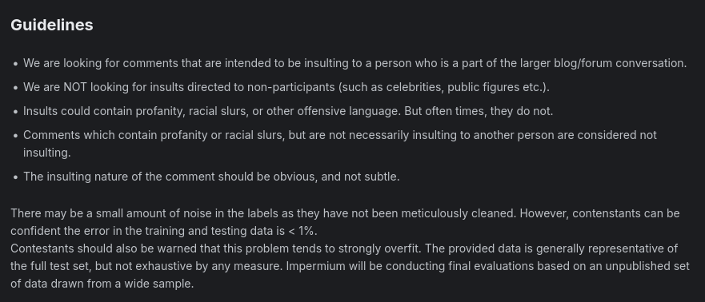

# Detecting Insults in Social Commentary

Dataset source : [https://www.kaggle.com/c/detecting-insults-in-social-commentary/data](https://www.kaggle.com/c/detecting-insults-in-social-commentary/data)

```python
import kagglehub

# Download latest version
path = kagglehub.competition_download('detecting-insults-in-social-commentary')

print("Path to competition files:", path)
```


